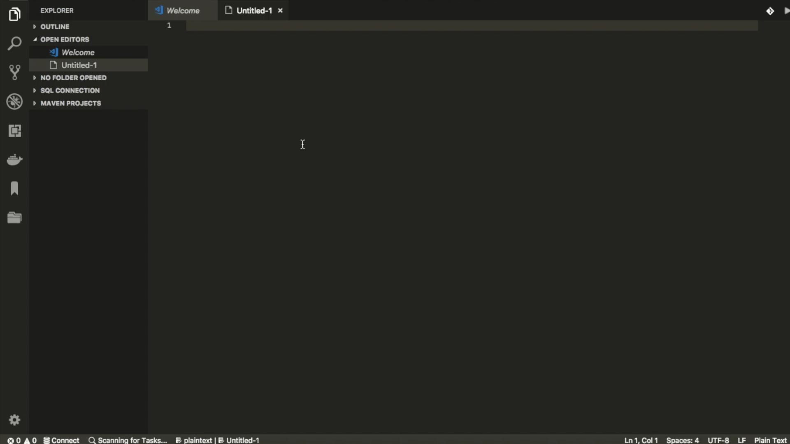

# FileListUpExtension README

This extension lists up file names and paths (CSV format).

## Features

### Available commands

* Lists up file name and file path: List up file names and paths where specified path (absolute path).

### How to use

* Open new file

* Open command pallet

* Type 'List up file name and file path'

* Input absolute path where you want to list up file names and paths

