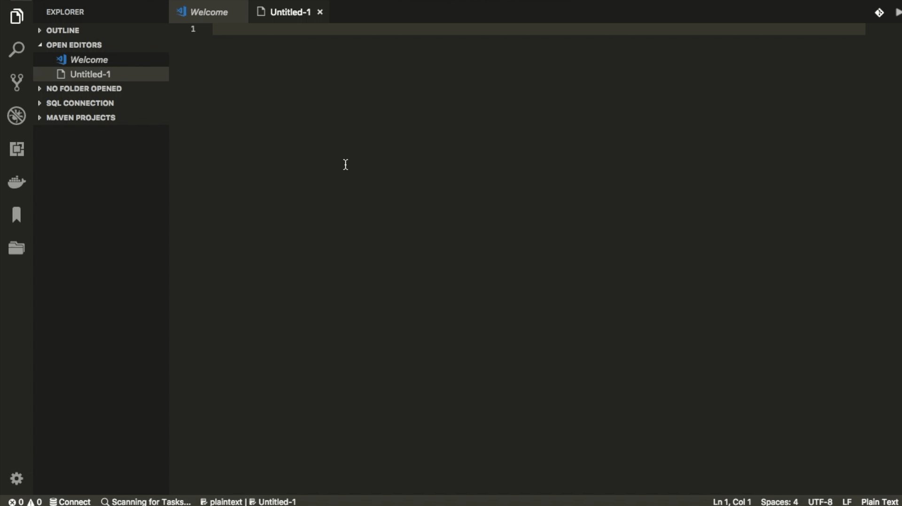

# FileListUpExtension

A VS Code extension that lists file names and their directories into the active editor as CSV.

## Requirements

VS Code **1.90.0** or later.

## Features

* Walks a directory tree and writes one CSV row per file
* Shows progress while searching, and the search can be cancelled at any time
* Skips noisy directories such as `node_modules` and `.git` (configurable)
* Escapes the CSV per RFC 4180, so file names containing `,`, `"` or a line break stay intact
* Keeps going when a directory cannot be read, and reports how many were skipped

## How to use

1. Open the file you want the list written into

2. Open the command palette and run **File List Up: List up file name and file path**

3. Type the directory to search, or press the folder button to pick one.
   The path is pre-filled with the first workspace folder

The listing is inserted at the cursor as a single block.



## Output

```csv
FileName,FilePath
readme.md,/home/user/project/
index.ts,/home/user/project/src/
```

`FilePath` is the **directory the file lives in**, with a trailing separator — not the full path to the file.

## Settings

| Setting | Default | Description |
| --- | --- | --- |
| `fileListUp.excludeDirectories` | `["node_modules", ".git", ".svn", ".hg"]` | Directory names that are never descended into. Matched exactly against the directory name, not as a glob. |

## Development

```sh
npm install
npm run compile   # tsc
npm run lint      # eslint
npm test          # compiles, lints, then runs the tests in a VS Code instance
```

Press `F5` to launch the extension in a new VS Code window.

## License

[MIT](LICENSE)
